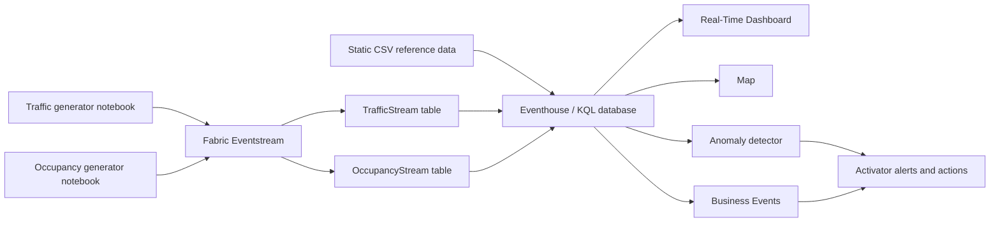

# Fabric Conference Barcelona 2026: Real-Time Intelligence Hackathon

Build an end-to-end Microsoft Fabric Real-Time Intelligence solution for live traffic and venue occupancy in Barcelona. During the hackathon, you will generate two event streams, route them through Eventstream, persist and enrich them in Eventhouse, visualize them on a map and Real-Time Dashboard, detect anomalies, create Business Events, and use Activator to respond to changing conditions.

> The data is synthetic and intended for demonstration and learning. Capacities, occupancy levels, traffic conditions, and incidents are estimates rather than operational data.

## Solution flow



Suggested Eventhouse table names in this guide are `TrafficStream`, `OccupancyStream`, `Segment`, `SegmentGeometry`, `SpeedState`, and `Status`. You may use different names, but update your KQL and downstream items consistently.

## Repository contents

| Path | Purpose |
| --- | --- |
| `Data generators/barcelona_traffic_generator.ipynb` | Generates historical conference-week traffic at five-minute event-time intervals and replays it to Eventstream. |
| `Data generators/ccib_occupancy_stream_generator.ipynb` | Generates current occupancy for 15 attendee-relevant locations and streams a new batch every five seconds. |
| `Static data/segment.csv` | Maps the 78 generated traffic segment IDs to eight approximate Barcelona traffic zones. |
| `Static data/segment_long.csv` | Detailed coordinate points for a larger source catalog of Barcelona road segments. |
| `Static data/Speed_state.csv` | Traffic speed-state lookup. |
| `Static data/status.csv` | Traffic sensor-status lookup. |
| `Static data/Barcelona.geojson` | Barcelona basic statistical area boundaries for map context. |

## Prerequisites

- Access to a Fabric capacity and a workspace where you can create an Eventstream, Eventhouse/KQL Database, Real-Time Dashboard, map, anomaly detector, Business Events, and Activator items.
- Python with `pandas`, `numpy`, and `azure-eventhub` for the traffic generator.
- Python with `pandas` and `azure-eventhub` for the occupancy generator.
- Two Eventstream custom endpoint connections, one for traffic and one for occupancy, or an agreed design that keeps the two schemas separable.
- The traffic notebook's three lookup CSVs available in its working directory: `segment.csv`, `Speed_state.csv`, and `status.csv`.
- A `ccib_occupancy_locations.geojson` input file available in the occupancy notebook's working directory. The notebook expects 15 unique locations with `occupancySignalId`, `name`, `category`, `totalOccupancy`, and polygon geometry. This required input is not currently included in this repository.

Keep connection strings out of source control. Use notebook environment variables or another secret-management mechanism when configuring the Eventstream custom endpoints.

## Generated dataset 1: Traffic

The traffic notebook models 78 road segments across eight zones from 27 September through 1 October 2026. It generates one reading per segment every five minutes, including conference arrival, lunch, and departure effects around CCIB, ordinary daily traffic patterns, sensor outages, and injected incidents.

At the default `SPEED_FACTOR = 12`, each five-minute event-time interval is emitted approximately every 25 seconds. Each Eventstream batch contains all 78 segment readings for that interval. Setting `LIVE_SLEEP = False` sends the generated data as a fast backfill.

### Traffic Eventstream schema

| Column | Suggested KQL type | Description |
| --- | --- | --- |
| `segment_id` | `long` | Identifier of the road segment, from 1 through 78. Join to `Segment.segment_id` for the approximate zone. |
| `timestamp` | `datetime` | Event time at five-minute granularity. Values are ISO 8601 timestamps generated in Barcelona local time with the UTC offset included. |
| `status_code` | `long` | Sensor availability code. `1` means active and `0` means no reading is available. Join to `Status.status_code`. |
| `speed_state_code` | `long` | Traffic classification: `-1` no data, `0` unknown/below threshold, `1` fluid, `2` dense, or `3` congested. Join to `SpeedState.speed_state_code`. |
| `vehicle_count` | `long` | Synthetic number of vehicles observed in the segment's five-minute window. It is derived from zone capacity, time of day, conference load, and random variation. It is `0` during a simulated sensor outage. |
| `avg_speed_kmh` | `real` | Synthetic average speed in kilometres per hour. It is normally 46-68 for fluid, 25-45 for dense, and 4-24 for congested traffic; it is null when no speed can be classified. |
| `incident_flag` | `bool` | Whether the reading is associated with a likely or injected incident. Sensor-outage records are always `false`. |

The notebook also writes `barcelona_traffic_data.csv` locally. That generated file contains all streamed columns plus `zone_approx`, the denormalized zone label used by the notebook for generation and validation. `zone_approx` is deliberately not sent in the Eventstream payload so participants can enrich traffic in Eventhouse using `segment.csv`.

### Traffic behavior to look for

- `Sant Marti / Ronda Litoral`, the CCIB area, receives the strongest conference load.
- `Eixample / Diagonal` and ring-road/access zones receive smaller conference effects.
- Speed state `3` and lower `avg_speed_kmh` values identify congestion.
- Some records have `status_code = 0`, `speed_state_code = -1`, zero vehicles, and null speed to model an unavailable sensor.
- `incident_flag = true` provides useful event candidates, while `speed_state_code = 3` is the required basis for congested-segment Business Events.

## Generated dataset 2: Occupancy

The occupancy notebook models the CCIB conference venue plus 14 attendee-relevant hotels, cafes, and interesting spots. Every five seconds it emits one current reading for each of the 15 locations. Normal occupancy follows a category-specific time-of-day curve.

Exactly one rotating location receives a synthetic anomaly during each five-minute Barcelona-time window. Even-numbered windows spike close to 96% of capacity and odd-numbered windows drop close to 4%, with a small amount of noise. This gives the anomaly detector a repeatable signal to discover.

### Occupancy Eventstream schema

| Column | Suggested KQL type | Description |
| --- | --- | --- |
| `occupancySignalId` | `string` | Unique, stable identifier of the location/signal. Use it as the entity key for time-series analysis and alerts. |
| `category` | `string` | Location category: `conference_venue`, `hotel`, `cafe`, or `interesting_spot`. |
| `currentOccupancy` | `long` | Synthetic current number of occupants, bounded between zero and `totalOccupancy`. The rotating spike/drop is represented in this value. |
| `totalOccupancy` | `long` | Fixed synthetic maximum capacity of the location. Use `100.0 * currentOccupancy / totalOccupancy` to calculate occupancy percentage. |
| `geometry` | `dynamic` | GeoJSON `Polygon` object centered on the location. The polygon itself is category-shaped for map rendering: conference building, hotel, cafe cup, or interesting-spot magnifying glass. Coordinate order is longitude then latitude. |

The occupancy payload does not include an event timestamp or location name. Configure Eventstream or the Eventhouse ingestion mapping to retain ingestion time, for example as `ingestion_timestamp`, and use that column as the time axis for the Real-Time Dashboard and anomaly detector. The location `name` exists only in the notebook's input catalog and is not streamed by the current implementation.

## Static data dictionaries

Load the CSV files into Eventhouse as reference tables. Preserve the numeric code columns as `long`; all labels and descriptions can be `string`.

### `segment.csv` to `Segment`

This file contains 78 rows, one for every generated traffic segment.

| Column | Suggested KQL type | Description |
| --- | --- | --- |
| `segment_id` | `long` | Unique traffic segment identifier and join key to `TrafficStream.segment_id`. |
| `zone_approx` | `string` | Approximate zone/corridor grouping. The 78 segments are distributed across eight zones, including `Sant Marti / Ronda Litoral` and `Eixample / Diagonal`. |

### `segment_long.csv` to `SegmentGeometry`

This file contains 3,228 coordinate rows for 527 road-segment identifiers from a broader source catalog. A segment is represented by multiple ordered component points. The combination of `Tram` and `Tram_Components` is unique.

| Column | Suggested KQL type | Description |
| --- | --- | --- |
| `Tram` | `long` | Source road-section identifier. There are 527 distinct values in the file, ranging from 1 to 534. |
| `Tram_Components` | `long` | Component/point sequence within a `Tram`. Order by this field when constructing a line for a road section. |
| `Descripci_` | `string` | Human-readable Catalan route description, usually including the direction or endpoints. |
| `Longitud` | `real` | Longitude of the component point in decimal degrees. GeoJSON and map coordinate order is longitude first. |
| `Latitud` | `real` | Latitude of the component point in decimal degrees. |

`segment_long.csv` is not a strict 78-row dimension for the generator. Although `Tram` values overlap numerically with some generated `segment_id` values, the repository does not establish a complete one-to-one relationship between the files. Validate the intended mapping before joining it to `TrafficStream`; use `segment.csv` as the authoritative enrichment table for the generated traffic IDs.

### `Speed_state.csv` to `SpeedState`

| Column | Suggested KQL type | Description |
| --- | --- | --- |
| `speed_state_code` | `long` | Unique lookup key used by `TrafficStream.speed_state_code`. |
| `speed_state_label` | `string` | Display label: `No Data`, `Unknown / Below Threshold`, `Fluid`, `Dense`, or `Congested`. |
| `description` | `string` | Business explanation of the speed classification. |
| `typical_speed_kmh` | `string` | Human-readable expected speed band. It is blank for codes `-1` and `0`, `>45` for fluid, `25-45` for dense, and `<25` for congested. |

### `status.csv` to `Status`

| Column | Suggested KQL type | Description |
| --- | --- | --- |
| `status_code` | `long` | Unique lookup key used by `TrafficStream.status_code`: `0` or `1`. |
| `status_label` | `string` | Display label: `No Data` for `0` and `Active` for `1`. |
| `description` | `string` | Business explanation of the sensor/section availability state. |

### `Barcelona.geojson` map context

This optional static file is a GeoJSON `FeatureCollection` containing 233 Barcelona basic statistical area features: 231 polygons and 2 multipolygons. It does not have a confirmed join key to the generated traffic or occupancy datasets, so use it as a contextual boundary layer rather than as required stream enrichment.

The file contains extensive cartographic metadata. The most useful properties for this hackathon are:

| Property | Description |
| --- | --- |
| `AEB` / `LITERAL` | Unique basic statistical area code in this file. |
| `DISTRICTE` | Barcelona district code. |
| `BARRI` | Neighborhood code. |
| `ZUA` | Urban-area grouping code. |
| `TIPUS_UA` | Administrative unit type; values identify AEB features. |
| `PERIMETRE` | Polygon perimeter from the source dataset. |
| `AREA` | Polygon area from the source dataset. |
| `NDESCR_CA`, `NDESCR_ES`, `NDESCR_EN` | Feature descriptions in Catalan, Spanish, and English. |
| `geometry` | GeoJSON `Polygon` or `MultiPolygon` coordinates for the map layer. |

Other properties (`ID_*`, `*_DESCR`, `NIVELL`, `TERME`, representation, scale, style, and color fields) are source-system classification and cartographic metadata. Several web/document/name fields are null throughout this extract.

## Eventhouse enrichment

Create an enriched traffic query or update policy that joins the stream to the three compact lookup tables. The core relationship is:

```kusto
TrafficStream
| lookup kind=leftouter (Segment) on segment_id
| lookup kind=leftouter (SpeedState) on speed_state_code
| lookup kind=leftouter (Status) on status_code
```

The result should retain the original measures and add `zone_approx`, `speed_state_label`, the speed-state description/band, `status_label`, and the status description. Avoid projecting two columns with the same name; rename the two lookup descriptions when materializing an enriched table.

## Suggested hackathon build order

1. Create traffic and occupancy custom endpoint sources in Eventstream.
2. Configure each notebook with its matching endpoint and start both generators.
3. Confirm that Eventstream previews show correctly parsed events for both schemas.
4. Add Eventhouse destinations and verify that `TrafficStream` and `OccupancyStream` continue to receive rows.
5. Ingest the static CSVs into lookup tables and enrich traffic by the documented keys.
6. Build a Real-Time Dashboard for speed, vehicle count, congestion, incidents, occupancy, and occupancy percentage.
7. Build a Barcelona map that updates from live traffic and occupancy data. Use occupancy `geometry` directly and use validated traffic coordinates/geometry for road segments.
8. Create an anomaly detector over occupancy or traffic volume and configure alerts/actions in Activator.
9. Create Business Events for records where `speed_state_code == 3`, including at least segment, event time, speed, vehicle count, incident indicator, and enriched zone.
10. Run an end-to-end test and capture evidence for every success criterion.

## Success criteria

The hackathon solution is complete when all of the following are demonstrated:

- [ ] **Traffic and occupancy events are flowing into Eventstream.** Both live sources show incoming, correctly parsed events with their expected schemas.
- [ ] **Traffic and occupancy data also flow into Eventhouse.** New rows appear while the notebooks are running, and timestamps/ingestion times support live time-series queries.
- [ ] **Traffic data is enriched with static data in Eventhouse.** A query or materialized table joins traffic to segment, speed-state, and status reference data and returns readable zone and state labels.
- [ ] **A map shows live traffic and occupancy updates in the Barcelona region.** Traffic condition and occupancy/capacity changes are visible and refresh while events arrive.
- [ ] **An anomaly detector is created and alerts are configured.** The detector identifies the generated spike/drop behavior or traffic-volume anomalies, and Activator has an enabled alert/action for detected anomalies.
- [ ] **Business Events are created for congested segments.** A Business Event is emitted when `speed_state_code == 3`, with enough segment and enriched location context to investigate the congestion.

## Validation tips

- Check both Eventstream input and output event counts; a source preview alone does not prove Eventhouse ingestion.
- Verify enrichment with `countif(isempty(zone_approx))` and investigate unmatched segment IDs.
- For occupancy anomalies, chart occupancy percentage by `occupancySignalId` using ingestion time and a five-second or one-minute bin.
- For live traffic maps, use `arg_max(timestamp, *) by segment_id` so each segment displays only its latest state.
- Confirm an alert by observing a detector result and its corresponding Activator run/action, not only by saving the rule.
- Confirm Business Events with at least one known congested record from the traffic stream.
