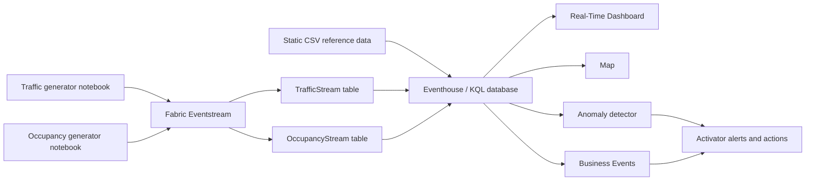

# Barcelona Smart City Pulse: Coordinating Mobility, Safety, and Events in Real Time

## The business story

Barcelona is preparing to host the **European Microsoft Fabric Conference 2026** at the Barcelona International Convention Centre (CCIB). For the city, the event is more than a venue operation: thousands of journeys, changing traffic conditions, and shifting occupancy across hotels, cafes, public spaces, and the conference center create a connected urban challenge.

On a busy conference morning, traffic begins to slow along the Ronda Litoral while occupancy near the CCIB rises rapidly. Each signal looks manageable in isolation. Together, they point to a developing problem: attendees are converging on a congested corridor, entrance queues may grow, nearby locations may exceed comfortable capacity, and a single incident could disrupt both the event and the surrounding district. Traditional reports would explain the disruption after it happened. A smart city must recognize the pattern and respond while there is still time to change the outcome.

The **Barcelona Smart City Operations Center** creates a live operational picture from traffic and occupancy data. Microsoft Fabric Eventstream captures signals as they happen, Eventhouse unifies them for analysis, and Real-Time Dashboards and maps reveal where pressure is building. Anomaly detection identifies unusual crowd movement, Business Events turn congestion into actionable signals, and Activator alerts the right teams so they can redirect arrivals, adjust venue staffing, open alternative entrances, or communicate travel guidance before disruption spreads.

Your mission is to build this real-time nervous system for the city. The finished solution should help city and event operators answer three questions continuously: **Where is congestion forming? Which locations are approaching critical occupancy? What action should we take right now?** The same pattern can extend beyond conferences to festivals, sporting events, transport hubs, and emergency response, making this a reusable smart-city capability rather than a one-day dashboard.

> The data is synthetic and intended for demonstration and learning. Capacities, occupancy levels, traffic conditions, and incidents are estimates rather than operational data.

## Solution flow



Suggested Eventhouse table names in this guide are `TrafficStream`, `OccupancyStream`, `SegmentGeometry`, `SpeedState`, and `Status`. You may use different names, but update your KQL and downstream items consistently.

## Repository contents

| Path | Purpose |
| --- | --- |
| `Data generators/barcelona_traffic_generator.ipynb` | Generates conference-week traffic for all 527 road segments in `segment_long.csv` at five-minute event-time intervals and replays it to Eventstream. |
| `Data generators/occupancy_stream_generator.ipynb` | Generates current occupancy for 15 attendee-relevant locations and streams a new batch every five seconds. By default it stops after 120 batches (10 minutes). |
| `Static data/segment_long.csv` | Detailed coordinate points for a larger source catalog of Barcelona road segments. |
| `Static data/speed_state.csv` | Traffic speed-state lookup. |
| `Static data/status.csv` | Traffic sensor-status lookup. |
| `Static data/barcelona.geojson` | Barcelona basic statistical area boundaries for map context. |
| `Static data/occupancy_locations.geojson` | Source catalog of the 15 CCIB-area occupancy locations used by the occupancy generator. |

## Prerequisites

- Access to a Fabric capacity and a workspace where you can create an Eventstream, Eventhouse/KQL Database, Real-Time Dashboard, map, anomaly detector, Business Events, and Activator items.
- Python with `pandas`, `numpy`, and `azure-eventhub` for the traffic generator.
- Python with `pandas` and `azure-eventhub` for the occupancy generator.
- Two Eventstream custom endpoint connections, one for traffic and one for occupancy, or an agreed design that keeps the two schemas separable.
- A Fabric notebook attached to a default lakehouse. Upload `segment_long.csv`, `speed_state.csv`, `status.csv`, and `occupancy_locations.geojson` from `Static data/` to the lakehouse `Files` area. The notebooks currently read them from `/lakehouse/default/Files/`.
- The occupancy catalog must retain 15 unique locations with `occupancySignalId`, `name`, `category`, positive `totalOccupancy`, and closed Polygon geometry. The included file satisfies this contract.

Keep connection strings out of source control. Use notebook environment variables or another secret-management mechanism when configuring the Eventstream custom endpoints.

## Generated dataset 1: Traffic

The traffic notebook models all 527 distinct `Tram` road segments in `segment_long.csv`, assigned across eight approximate zones, from 27 September through 1 October 2026. It generates one reading per segment every five minutes, including conference arrival, lunch, and departure effects around CCIB, ordinary daily traffic patterns, sensor outages, and seven injected incidents.

At the default `SPEED_FACTOR = 12`, each five-minute event-time interval is emitted approximately every 25 seconds. Each Eventstream batch contains all 527 segment readings for that interval. Setting `LIVE_SLEEP = False` sends the generated data as a fast backfill.

### Traffic Eventstream schema

| Column | Suggested KQL type | Description |
| --- | --- | --- |
| `segment_id` | `long` | Authoritative road-section identifier copied from `segment_long.csv.Tram`. The 527 distinct values range from 1 through 534 and are not required to be contiguous. |
| `timestamp` | `datetime` | Event time at five-minute granularity. Values are ISO 8601 timestamps generated in Barcelona local time with the UTC offset included. |
| `status_code` | `long` | Sensor availability code. `1` means active and `0` means no reading is available. Join to `Status.status_code`. |
| `speed_state_code` | `long` | Traffic classification: `-1` no data, `0` unknown/below threshold, `1` fluid, `2` dense, or `3` congested. Join to `SpeedState.speed_state_code`. |
| `vehicle_count` | `long` | Synthetic number of vehicles observed in the segment's five-minute window. It is derived from zone capacity, time of day, conference load, and random variation. It is `0` during a simulated sensor outage. |
| `avg_speed_kmh` | `real` | Synthetic average speed in kilometres per hour. It is normally 46-68 for fluid, 25-45 for dense, and 4-24 for congested traffic; it is null when no speed can be classified. |
| `incident_flag` | `bool` | Whether the reading is associated with a likely or injected incident. Sensor-outage records are always `false`. |
| `zone_approx` | `string` | One of eight generated zone labels, assigned from segment geometry, distance to CCIB, and the road description. |
| `road_name` | `string` | Catalan road description copied from the first ordered component's `Descripci_`. |
| `start_lat`, `start_lng` | `real` | Coordinates of the first ordered component point. |
| `end_lat`, `end_lng` | `real` | Coordinates of the last ordered component point. |
| `mid_lat`, `mid_lng` | `real` | Arithmetic mean of all component-point coordinates, used as the segment midpoint. |
| `distance_to_ccib_m` | `real` | Haversine distance from the generated midpoint to CCIB, in metres. |

The generated dataframe and Eventstream payload have the same 16-column contract shown above. The current notebook does not write a local output CSV.

### Traffic behavior to look for

- `Sant Marti / Ronda Litoral`, the CCIB area, receives the strongest conference load.
- `Eixample / Diagonal` and ring-road/access zones receive smaller conference effects.
- Speed state `3` and lower `avg_speed_kmh` values identify congestion.
- Some records have `status_code = 0`, `speed_state_code = -1`, zero vehicles, and null speed to model an unavailable sensor.
- `incident_flag = true` provides useful event candidates, while `speed_state_code = 3` is the required basis for congested-segment Business Events.

## Generated dataset 2: Occupancy

The occupancy notebook models the CCIB conference venue plus 14 attendee-relevant hotels, cafes, and interesting spots. Every five seconds it emits one current reading for each of the 15 locations. Normal occupancy follows a category-specific time-of-day curve. The default `MAX_BATCHES = 120` produces a 10-minute run; set it to `None` to run continuously.

Exactly one rotating location receives a synthetic anomaly during each five-minute Barcelona-time window. Even-numbered windows spike close to 96% of capacity and odd-numbered windows drop close to 4%, with a small amount of noise. This gives the anomaly detector a repeatable signal to discover.

### Occupancy Eventstream schema

| Column | Suggested KQL type | Description |
| --- | --- | --- |
| `occupancySignalId` | `string` | Unique, stable identifier of the location/signal. Use it as the entity key for time-series analysis and alerts. |
| `category` | `string` | Location category: `conference_venue`, `hotel`, `cafe`, or `interesting_spot`. |
| `currentOccupancy` | `long` | Synthetic current number of occupants, bounded between zero and `totalOccupancy`. The rotating spike/drop is represented in this value. |
| `totalOccupancy` | `long` | Fixed synthetic maximum capacity of the location. Use `100.0 * currentOccupancy / totalOccupancy` to calculate occupancy percentage. |
| `geometry` | `dynamic` | GeoJSON `Polygon` object centered on the location. The polygon itself is category-shaped for map rendering: conference building, hotel, cafe cup, or interesting-spot magnifying glass. Coordinate order is longitude then latitude. |

The occupancy payload does not include an event timestamp or location name. Configure Eventstream or the Eventhouse ingestion mapping to retain ingestion time, for example as `ingestion_timestamp`, and use that column as the time axis for the Real-Time Dashboard and anomaly detector. The location `name` exists only in the notebook's input catalog and is not streamed by the current implementation.

## Static data dictionaries

Load the CSV files into Eventhouse as reference tables. Preserve the numeric code columns as `long`; all labels and descriptions can be `string`.

### `segment_long.csv` to `SegmentGeometry`

This file contains 3,228 coordinate rows for 527 road-segment identifiers from a broader source catalog. A segment is represented by multiple ordered component points. The combination of `Tram` and `Tram_Components` is unique.

| Column | Suggested KQL type | Description |
| --- | --- | --- |
| `Tram` | `long` | Source road-section identifier. There are 527 distinct values in the file, ranging from 1 to 534. |
| `Tram_Components` | `long` | Component/point sequence within a `Tram`. Order by this field when constructing a line for a road section. |
| `Descripci_` | `string` | Human-readable Catalan route description, usually including the direction or endpoints. |
| `Longitud` | `real` | Longitude of the component point in decimal degrees. GeoJSON and map coordinate order is longitude first. |
| `Latitud` | `real` | Latitude of the component point in decimal degrees. |

The traffic generator groups this file by `Tram` and copies that value directly to `TrafficStream.segment_id`. The relationship is therefore exact at the segment level. Because `SegmentGeometry` contains multiple component rows per segment, joining it directly to the stream is one-to-many and will duplicate traffic readings; summarize it to one row per `Tram` first when a segment dimension is needed.

### `speed_state.csv` to `SpeedState`

| Column | Suggested KQL type | Description |
| --- | --- | --- |
| `speed_state_code` | `long` | Unique lookup key used by `TrafficStream.speed_state_code`. |
| `speed_state_label` | `string` | Display label: `No Data`, `Unknown / Below Threshold`, `Fluid`, `Dense`, or `Congested`. |
| `description` | `string` | Business explanation of the speed classification. |
| `typical_speed_kmh` | `string` | Human-readable expected speed band. It is blank for codes `-1` and `0`, `>45` for fluid, `25-45` for dense, and `<25` for congested. |

### `status.csv` to `Status`

| Column | Suggested KQL type | Description |
| --- | --- | --- |
| `status_code` | `long` | Unique lookup key used by `TrafficStream.status_code`: `0` or `1`. |
| `status_label` | `string` | Display label: `No Data` for `0` and `Active` for `1`. |
| `description` | `string` | Business explanation of the sensor/section availability state. |

### `barcelona.geojson` map context

This optional static file is a GeoJSON `FeatureCollection` containing 233 Barcelona basic statistical area features: 231 polygons and 2 multipolygons. It does not have a confirmed join key to the generated traffic or occupancy datasets, so use it as a contextual boundary layer rather than as required stream enrichment.

The file contains extensive cartographic metadata. The most useful properties for this hackathon are:

| Property | Description |
| --- | --- |
| `AEB` / `LITERAL` | Unique basic statistical area code in this file. |
| `DISTRICTE` | Barcelona district code. |
| `BARRI` | Neighborhood code. |
| `ZUA` | Urban-area grouping code. |
| `TIPUS_UA` | Administrative unit type; values identify AEB features. |
| `PERIMETRE` | Polygon perimeter from the source dataset. |
| `AREA` | Polygon area from the source dataset. |
| `NDESCR_CA`, `NDESCR_ES`, `NDESCR_EN` | Feature descriptions in Catalan, Spanish, and English. |
| `geometry` | GeoJSON `Polygon` or `MultiPolygon` coordinates for the map layer. |

Other properties (`ID_*`, `*_DESCR`, `NIVELL`, `TERME`, representation, scale, style, and color fields) are source-system classification and cartographic metadata. Several web/document/name fields are null throughout this extract.

### `occupancy_locations.geojson` source catalog

This GeoJSON `FeatureCollection` contains the 15 source locations consumed by the occupancy notebook. Each feature has `occupancySignalId`, `name`, `category`, and `totalOccupancy` properties plus a Polygon footprint. The notebook keeps each footprint's center but replaces its coordinates in memory with a category-specific Polygon silhouette before streaming. `name` remains catalog-only and is not included in the five-column Eventstream payload.

## Eventhouse enrichment

The traffic stream already includes `zone_approx`, `road_name`, start/end/midpoint coordinates, and distance to CCIB derived from `segment_long.csv`. Add readable state labels with the two compact lookup tables:

```kusto
TrafficStream
| lookup kind=leftouter (SpeedState) on speed_state_code
| lookup kind=leftouter (Status) on status_code
```

The result should retain the original measures and geometry fields and add `speed_state_label`, the speed-state description/band, `status_label`, and the status description. Avoid projecting two columns with the same name; rename the two lookup descriptions when materializing an enriched table. Use `SegmentGeometry` only when the full ordered road line is required, and first aggregate its component rows by `Tram` to avoid multiplying stream records.

## Suggested hackathon build order

1. Create traffic and occupancy custom endpoint sources in Eventstream.
2. Configure each notebook with its matching endpoint and start both generators.
3. Confirm that Eventstream previews show correctly parsed events for both schemas.
4. Add Eventhouse destinations and verify that `TrafficStream` and `OccupancyStream` continue to receive rows.
5. Ingest the static CSVs into reference tables. Enrich traffic with speed-state and status labels; retain `SegmentGeometry` for detailed road-line construction if needed.
6. Build a Real-Time Dashboard for speed, vehicle count, congestion, incidents, occupancy, and occupancy percentage.
7. Build a Barcelona map that updates from live traffic and occupancy data. Use occupancy `geometry` directly and the streamed traffic midpoint or start/end coordinates.
8. Create an anomaly detector over occupancy or traffic volume and configure alerts/actions in Activator.
9. Create Business Events for records where `speed_state_code == 3`, including at least segment, event time, speed, vehicle count, incident indicator, and enriched zone.
10. Run an end-to-end test and capture evidence for every success criterion.

## Success criteria

The hackathon solution is complete when all of the following are demonstrated:

- [ ] **Traffic and occupancy events are flowing into Eventstream.** Both live sources show incoming, correctly parsed events with their expected schemas.
- [ ] **Traffic and occupancy data also flow into Eventhouse.** New rows appear while the notebooks are running, and timestamps/ingestion times support live time-series queries.
- [ ] **Traffic data is enriched with static data in Eventhouse.** A query or materialized table joins traffic to speed-state and status reference data and returns readable state labels while retaining the streamed zone and geometry fields.
- [ ] **A map shows live traffic and occupancy updates in the Barcelona region.** Traffic condition and occupancy/capacity changes are visible and refresh while events arrive.
- [ ] **An anomaly detector is created and alerts are configured.** The detector identifies the generated spike/drop behavior or traffic-volume anomalies, and Activator has an enabled alert/action for detected anomalies.
- [ ] **Business Events are created for congested segments.** A Business Event is emitted when `speed_state_code == 3`, with enough segment and enriched location context to investigate the congestion.

## Validation tips

- Check both Eventstream input and output event counts; a source preview alone does not prove Eventhouse ingestion.
- Verify enrichment with `countif(isempty(speed_state_label))` and `countif(isempty(status_label))`; `zone_approx` is already populated by the traffic generator.
- For occupancy anomalies, chart occupancy percentage by `occupancySignalId` using ingestion time and a five-second or one-minute bin.
- For live traffic maps, use `arg_max(timestamp, *) by segment_id` so each segment displays only its latest state.
- Confirm an alert by observing a detector result and its corresponding Activator run/action, not only by saving the rule.
- Confirm Business Events with at least one known congested record from the traffic stream.
