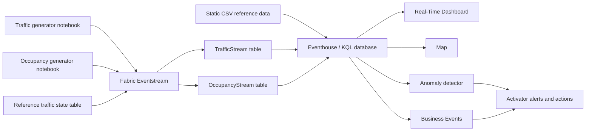

# Barcelona Smart City Pulse: Coordinating Mobility, Safety, and Events in Real Time

## The business story

Barcelona is preparing to host the **European Microsoft Fabric Conference 2026** at the Barcelona International Convention Centre (CCIB). For the city, the event is more than a venue operation: thousands of journeys, changing traffic conditions, and shifting occupancy across hotels, cafes, public spaces, and the conference center create a connected urban challenge.

On a busy conference morning, traffic begins to slow along the Ronda Litoral while occupancy near the CCIB rises rapidly. Each signal looks manageable in isolation. Together, they point to a developing problem: attendees are converging on a congested corridor, entrance queues may grow, nearby locations may exceed comfortable capacity, and a single incident could disrupt both the event and the surrounding district. Traditional reports would explain the disruption after it happened. A smart city must recognize the pattern and respond while there is still time to change the outcome.

The **Barcelona Smart City Operations Center** creates a live operational picture from traffic and occupancy data. Microsoft Fabric Eventstream captures signals as they happen, Eventhouse unifies them for analysis, and Real-Time Dashboards and maps reveal where pressure is building. Anomaly detection identifies unusual crowd movement, Business Events turn congestion into actionable signals, and Activator alerts the right teams so they can redirect arrivals, adjust venue staffing, open alternative entrances, or communicate travel guidance before disruption spreads.

Your mission is to build this real-time nervous system for the city. The finished solution should help city and event operators answer three questions continuously: **Where is congestion forming? Which locations are approaching critical occupancy? What action should we take right now?** The same pattern can extend beyond conferences to festivals, sporting events, transport hubs, and emergency response, making this a reusable smart-city capability rather than a one-day dashboard.

> The data is synthetic and intended for demonstration and learning. Capacities, occupancy levels, traffic conditions, and incidents are estimates rather than operational data.

## Solution flow

Suggested Eventhouse table names in this guide are `TrafficStream`, `OccupancyStream`, `SegmentGeometry`, `SpeedState`, and `Status`. You may use different names, but update your KQL and downstream items consistently.

## Repository contents

| Path | Purpose |
| --- | --- |
| `Data generators/barcelona_traffic_generator.ipynb` | Generates conference-week traffic for all 527 road segments in `segment_long.csv` at five-minute event-time intervals and replays it to Eventstream. |
| `Data generators/occupancy_stream_generator.ipynb` | Generates current occupancy for 15 attendee-relevant locations and streams a new batch every five seconds. By default it stops after 120 batches (10 minutes). |
| `Static data/segment_long.csv` | Detailed coordinate points for a larger source catalog of Barcelona road segments. |
| `Static data/speed_state.csv` | Traffic speed-state lookup. |
| `Static data/status.csv` | Traffic sensor-status lookup. |
| `Static data/barcelona.geojson` | Barcelona basic statistical area boundaries for map context. |
| `Static data/occupancy_locations.geojson` | Source catalog of the 15 CCIB-area occupancy locations used by the occupancy generator. |
| `Helper/sqltransformation.sql` | Example SQL code for the Eventstream enrichment of data and multiple destinations. |
| `Helper/traffic_schema.json` | Schema of the events after been enriched for the Business Events. |
| `Helper/segment_geometry_kql.kql` | KQL function that adds the geometry calculations to the segment table. |
| `Helper/kql_example_queries.kql` | Example queries to be used for the analysis of data. |

## Welcome to the hack

You are the real-time engineering team supporting the Barcelona Smart City Operations Center. The conference opens soon, live signals are becoming available, and the operations team needs a solution that helps them detect pressure before it becomes disruption.

The hack is divided into three acts:

| Act | Focus | Outcome |
| --- | --- | --- |
| **Act 1: Ingest and Process Data** | Eventstream, generator notebooks, stream processing, and reference-data enrichment | Trusted traffic and occupancy streams are flowing into Fabric. |
| **Act 2: Analyze Data** | Eventhouse, shortcuts, functions, materialized views, and KQL investigation | Live and static data produce reusable operational insights. |
| **Act 3: Visualize Data** | Fabric Map, Real-Time Dashboard, anomaly detection, and optional Operations agent | Operators can see developing problems and decide how to respond. |

This is not a click-by-click lab. Each act gives your team a mission, constraints, clues, and evidence to produce. You decide how to organize the artifacts, model the data, write the queries, and present the final operational story.

### Rules of engagement

- Build the smallest end-to-end path first, then improve it.
- Validate each handoff before moving to the next act.
- Keep the traffic and occupancy contracts clear and separable.
- Capture evidence as you work: previews, row counts, query results, maps, dashboards, and alerts.
- Use the helper files as clues, not as a substitute for understanding the design.
- A justified alternative design is valid if it meets the success criteria.

## Before the clock starts

Your team needs:

- Access to a Fabric capacity and a workspace where you can create the required Real-Time Intelligence items.
- Permission to create or attach a lakehouse and run Fabric notebooks.
- The repository files available locally.
- A notebook environment capable of using `pandas`, `numpy`, and `azure-eventhub`.

Upload `segment_long.csv`, `speed_state.csv`, `status.csv`, and `occupancy_locations.geojson` from `Static data/` to the default lakehouse `Files` area. The generator notebooks currently read these files from `/lakehouse/default/Files/`.

Keep connection strings out of source control. Configure them only in the notebook session or through an approved secret-management mechanism.

## Act 1: Ingest and Process Data

### The mission

Bring two independent live signals into Microsoft Fabric:

- Traffic conditions across 527 Barcelona road segments.
- Occupancy at the CCIB and 14 attendee-relevant locations.

The raw numeric codes are useful to systems but not to operators. Process the traffic stream so its state is understandable, then deliver both streams to the analytical layer without losing the fields required later for maps, time-series analysis, and alerts.

### Your challenges

- Design the Eventstream topology for the two different event contracts.
- Create custom endpoint sources and connect the matching generator notebook to each source.
- Prove that both feeds arrive continuously and are parsed correctly.
- Decide how to retain event time for traffic and a usable time axis for occupancy.
- Enrich traffic with appropriate static reference data.
- Route traffic and occupancy into separate Eventhouse tables.
- Handle nulls, type differences, and reference-data mismatches explicitly.

<strong>Stuck? Reveal the constraints and clues</strong> — Try solving the challenge with your team before opening this section.

#### Constraints

- The two source schemas must remain distinguishable.
- Traffic enrichment must not remove location, zone, or geometry-related fields needed in later acts.
- Occupancy does not include an event timestamp in its payload.
- Secrets must not be committed to the repository.
- The solution must continue to receive new rows while the generators run.

#### Clues

- `speed_state_code` connects the traffic stream to `speed_state.csv`.
- Eventstream can expose a processing timestamp that may help with the occupancy time axis.
- The traffic notebook can run as accelerated live playback or as a fast backfill.
- The occupancy notebook emits one record for every location in each batch.
- `Helper/sqltransformation.sql` demonstrates one possible enrichment pattern.

### Evidence to unlock Act 2

- A live preview of both feeds.
- The expected traffic and occupancy fields with sensible data types.
- Human-readable traffic state information in the processed flow.
- New rows in separate traffic and occupancy Eventhouse tables.
- A short explanation of the timestamp chosen for each dataset.

## Traffic Eventstream schema

| Column | Suggested KQL type | Description |
| --- | --- | --- |
| `segment_id` | `long` | Authoritative road-section identifier copied from `segment_long.csv.Tram`. The 527 distinct values range from 1 through 534 and are not required to be contiguous. |
| `timestamp` | `datetime` | Event time at five-minute granularity. Values are ISO 8601 timestamps generated in Barcelona local time with the UTC offset included. |
| `status_code` | `long` | Sensor availability code. `1` means active and `0` means no reading is available. Join to `Status.status_code`. |
| `speed_state_code` | `long` | Traffic classification: `-1` no data, `0` unknown/below threshold, `1` fluid, `2` dense, or `3` congested. Join to `SpeedState.speed_state_code`. |
| `vehicle_count` | `long` | Synthetic number of vehicles observed in the segment's five-minute window. It is derived from zone capacity, time of day, conference load, and random variation. It is `0` during a simulated sensor outage. |
| `avg_speed_kmh` | `real` | Synthetic average speed in kilometres per hour. It is normally 46-68 for fluid, 25-45 for dense, and 4-24 for congested traffic; it is null when no speed can be classified. |
| `incident_flag` | `bool` | Whether the reading is associated with a likely or injected incident. Sensor-outage records are always `false`. |
| `zone_approx` | `string` | One of eight generated zone labels, assigned from segment geometry, distance to CCIB, and the road description. |
| `road_name` | `string` | Catalan road description copied from the first ordered component's `Descripci_`. |
| `start_lat`, `start_lng` | `real` | Coordinates of the first ordered component point. |
| `end_lat`, `end_lng` | `real` | Coordinates of the last ordered component point. |
| `mid_lat`, `mid_lng` | `real` | Arithmetic mean of all component-point coordinates, used as the segment midpoint. |
| `distance_to_ccib_m` | `real` | Haversine distance from the generated midpoint to CCIB, in metres. |

The generated dataframe and Eventstream payload have the same 16-column contract shown above. The current notebook does not write a local output CSV.

## Occupancy Eventstream schema

| Column | Suggested KQL type | Description |
| --- | --- | --- |
| `occupancySignalId` | `string` | Unique, stable identifier of the location/signal. Use it as the entity key for time-series analysis and alerts. |
| `category` | `string` | Location category: `conference_venue`, `hotel`, `cafe`, or `interesting_spot`. |
| `currentOccupancy` | `long` | Synthetic current number of occupants, bounded between zero and `totalOccupancy`. The rotating spike/drop is represented in this value. |
| `totalOccupancy` | `long` | Fixed synthetic maximum capacity of the location. Use `100.0 * currentOccupancy / totalOccupancy` to calculate occupancy percentage. |
| `geometry` | `dynamic` | GeoJSON `Polygon` object centered on the location. The polygon itself is category-shaped for map rendering: conference building, hotel, cafe cup, or interesting-spot magnifying glass. Coordinate order is longitude then latitude. |

The occupancy payload does not include an event timestamp or location name. Configure Eventstream or the Eventhouse ingestion mapping to retain ingestion time, for example as `ingestion_timestamp`, and use that column as the time axis for the Real-Time Dashboard and anomaly detector. The location `name` exists only in the notebook's input catalog and is not streamed by the current implementation.

## Act 2: Analyze Data

### The mission

Turn the incoming events into an analytical foundation for the operations center. Connect the static data through shortcuts, hide repeated logic behind reusable functions, accelerate important questions with materialized views, and investigate what is happening around the city and the CCIB.

Your work should help operators move from a city-level warning to the affected zone, road segment, occupancy location, and time window.

### Your challenges

- Make the lakehouse reference data available in Eventhouse through shortcuts.
- Build a correct road-segment geometry from the ordered coordinate points.
- Create reusable functions for enrichment and common calculations.
- Design materialized views for current-state or frequently used summaries.
- Investigate congestion, incidents, sensor health, occupancy pressure, and unusual behavior.
- Select the insights that deserve a place in the operational experience.

<strong>Stuck? Reveal the constraints and clues</strong> — Try solving the challenge with your team before opening this section.

#### Constraints

- `SegmentGeometry` contains multiple rows per segment. A direct join can duplicate traffic events.
- Static lookup keys and streamed keys must use compatible data types.
- Analysis must distinguish current state from historical trends.
- A materialized view should support a real operational question, not exist only to satisfy the challenge.
- Queries should remain useful while new data is arriving.

#### Clues

- Order segment points by `Tram_Components`.
- `lookup`, `arg_max()`, time bins, and series functions may be useful.
- Occupancy percentage makes differently sized locations comparable.
- High occupancy is not automatically an anomaly; context and history matter.
- `Helper/segment_geometry_kql.kql` and `Helper/kql_example_queries.kql` contain starting patterns.

### Questions worth investigating

- Which zones have the greatest concentration of congested readings?
- Which road segments are currently slowest?
- Is CCIB-area congestion persistent, recurring, or incident-driven?
- Which sensors repeatedly return no data?
- Which locations are nearing capacity?
- Where do the generated occupancy spikes and drops appear?
- What combination of traffic and occupancy would justify an operational response?

### Evidence to unlock Act 3

- Static data available to the KQL database through shortcuts.
- At least one reusable KQL function.
- At least one useful materialized view.
- One geometry result per road segment.
- Three analytical findings that influence the visual design.
- Proof that the analytical layer continues to update.

## Static data dictionaries

Load the CSV files into Eventhouse as reference tables. Preserve the numeric code columns as `long`; all labels and descriptions can be `string`.

### `segment_long.csv` to `SegmentGeometry`

This file contains 3,228 coordinate rows for 527 road-segment identifiers from a broader source catalog. A segment is represented by multiple ordered component points. The combination of `Tram` and `Tram_Components` is unique.

| Column | Suggested KQL type | Description |
| --- | --- | --- |
| `Tram` | `long` | Source road-section identifier. There are 527 distinct values in the file, ranging from 1 to 534. |
| `Tram_Components` | `long` | Component/point sequence within a `Tram`. Order by this field when constructing a line for a road section. |
| `Descripci_` | `string` | Human-readable Catalan route description, usually including the direction or endpoints. |
| `Longitud` | `real` | Longitude of the component point in decimal degrees. GeoJSON and map coordinate order is longitude first. |
| `Latitud` | `real` | Latitude of the component point in decimal degrees. |

The traffic generator groups this file by `Tram` and copies that value directly to `TrafficStream.segment_id`. The relationship is therefore exact at the segment level. Because `SegmentGeometry` contains multiple component rows per segment, joining it directly to the stream is one-to-many and will duplicate traffic readings; summarize it to one row per `Tram` first when a segment dimension is needed.

### `speed_state.csv` to `SpeedState`

| Column | Suggested KQL type | Description |
| --- | --- | --- |
| `speed_state_code` | `long` | Unique lookup key used by `TrafficStream.speed_state_code`. |
| `speed_state_label` | `string` | Display label: `No Data`, `Unknown / Below Threshold`, `Fluid`, `Dense`, or `Congested`. |
| `description` | `string` | Business explanation of the speed classification. |
| `typical_speed_kmh` | `string` | Human-readable expected speed band. It is blank for codes `-1` and `0`, `>45` for fluid, `25-45` for dense, and `<25` for congested. |

### `status.csv` to `Status`

| Column | Suggested KQL type | Description |
| --- | --- | --- |
| `status_code` | `long` | Unique lookup key used by `TrafficStream.status_code`: `0` or `1`. |
| `status_label` | `string` | Display label: `No Data` for `0` and `Active` for `1`. |
| `description` | `string` | Business explanation of the sensor/section availability state. |

### `barcelona.geojson` map context

This optional static file is a GeoJSON `FeatureCollection` containing 233 Barcelona basic statistical area features: 231 polygons and 2 multipolygons. It does not have a confirmed join key to the generated traffic or occupancy datasets, so use it as a contextual boundary layer rather than as required stream enrichment.

The file contains extensive cartographic metadata. The most useful properties for this hackathon are:

| Property | Description |
| --- | --- |
| `AEB` / `LITERAL` | Unique basic statistical area code in this file. |
| `DISTRICTE` | Barcelona district code. |
| `BARRI` | Neighborhood code. |
| `ZUA` | Urban-area grouping code. |
| `TIPUS_UA` | Administrative unit type; values identify AEB features. |
| `PERIMETRE` | Polygon perimeter from the source dataset. |
| `AREA` | Polygon area from the source dataset. |
| `NDESCR_CA`, `NDESCR_ES`, `NDESCR_EN` | Feature descriptions in Catalan, Spanish, and English. |
| `geometry` | GeoJSON `Polygon` or `MultiPolygon` coordinates for the map layer. |

Other properties (`ID_*`, `*_DESCR`, `NIVELL`, `TERME`, representation, scale, style, and color fields) are source-system classification and cartographic metadata. Several web/document/name fields are null throughout this extract.

### `occupancy_locations.geojson` source catalog

This GeoJSON `FeatureCollection` contains the 15 source locations consumed by the occupancy notebook. Each feature has `occupancySignalId`, `name`, `category`, and `totalOccupancy` properties plus a Polygon footprint. The notebook keeps each footprint's center but replaces its coordinates in memory with a category-specific Polygon silhouette before streaming. `name` remains catalog-only and is not included in the five-column Eventstream payload.

## Act 3: Visualize Data

### The mission

Build the live operational experience. The result should help a controller notice a problem, understand its location and severity, and decide what action to take.

Use Fabric Map, a Real-Time Dashboard, and anomaly detection to tell one connected operational story. An Operations agent is an optional challenge after the core experience works.

### Your challenges

- Create a Fabric Map showing live traffic and occupancy in the Barcelona region.
- Create a Real-Time Dashboard that answers the key business questions.
- Detect one of the generated occupancy or traffic anomalies.
- Configure an alert or action for a condition that deserves attention.
- Present the journey from incoming signal to operational response.
- Optionally create an Operations agent for natural-language investigation.

<strong>Stuck? Reveal the constraints and clues</strong> — Try solving the challenge with your team before opening this section.

#### Constraints

- Every visual must support a decision or investigation.
- Current-state visuals must not accidentally mix old and new readings.
- Traffic and occupancy colors, labels, and severity meanings should be consistent.
- Alerts must include enough context for someone to act.
- The optional agent must be grounded in trusted functions, views, or tables and its answers must be validated.

#### Clues

- Traffic can be mapped with midpoint coordinates or reconstructed road lines.
- Occupancy already contains dynamic GeoJSON polygons.
- Current-state views are useful map sources.
- Strong operational dashboards combine KPIs, trends, ranked problem areas, and details.
- The occupancy generator rotates a deliberate spike or drop every five-minute window.

### Minimum operational experience

- A Barcelona map with live traffic and occupancy context.
- Current congestion and occupancy KPIs.
- A trend focused on the CCIB area or another justified operational zone.
- A ranked list of locations or road segments requiring attention.
- A visible anomaly and an associated alert or action.

### Optional missions

- Add Barcelona boundaries as contextual map data.
- Create a combined pressure indicator using nearby traffic and occupancy.
- Create Business Events for congested segments.
- Add an Operations agent and test it with realistic operator questions.
- Explain how the design would scale to more sources, a larger city, or stricter latency requirements.

### Final demonstration

You have five minutes. Show:

1. The two generators producing events.
2. A live event becoming an Eventhouse row.
3. An analysis result that reveals an operational condition.
4. The condition appearing on the map or dashboard.
5. An anomaly, alert, Business Event, or recommended response.

Tell one convincing story rather than presenting every artifact.

## Success criteria

The hackathon solution is complete when all of the following are demonstrated:

- [ ] **Traffic and occupancy events are flowing into Eventstream.** Both live sources show incoming, correctly parsed events with their expected schemas.
- [ ] **Traffic and occupancy data also flow into Eventhouse.** New rows appear while the notebooks are running, and timestamps/ingestion times support live time-series queries.
- [ ] **Traffic data is enriched with static data in Eventhouse.** A query or materialized table joins traffic to speed-state and status reference data and returns readable state labels while retaining the streamed zone and geometry fields.
- [ ] **A map shows live traffic and occupancy updates in the Barcelona region.** Traffic condition and occupancy/capacity changes are visible and refresh while events arrive.
- [ ] **An anomaly detector is created and alerts are configured.** The detector identifies the generated spike/drop behavior or traffic-volume anomalies, and Activator has an enabled alert/action for detected anomalies.
- [ ] **Business Events are created for congested segments.** A Business Event is emitted when `speed_state_code == 3`, with enough segment and enriched location context to investigate the congestion.
